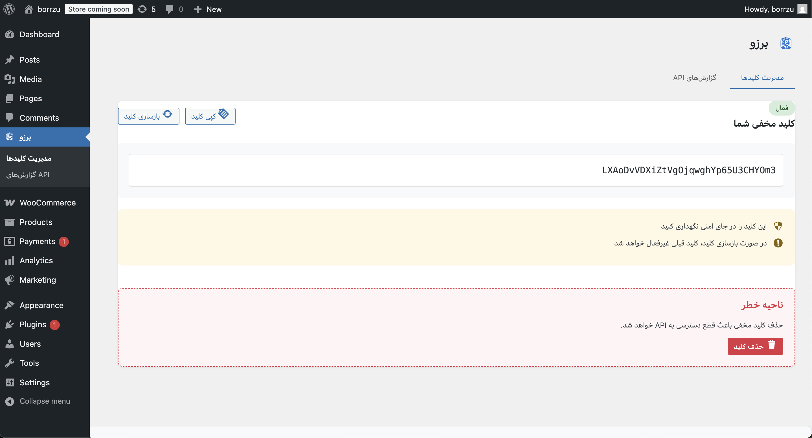
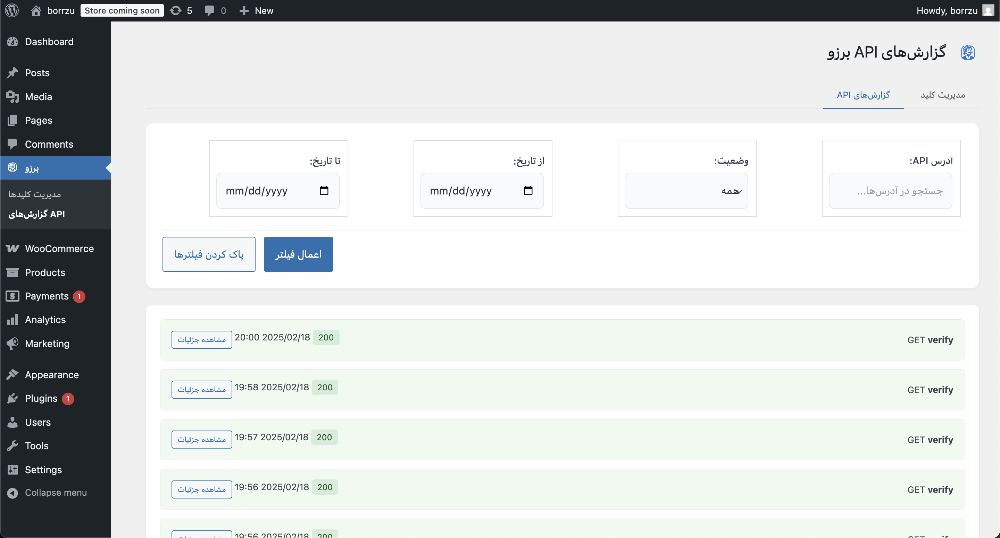
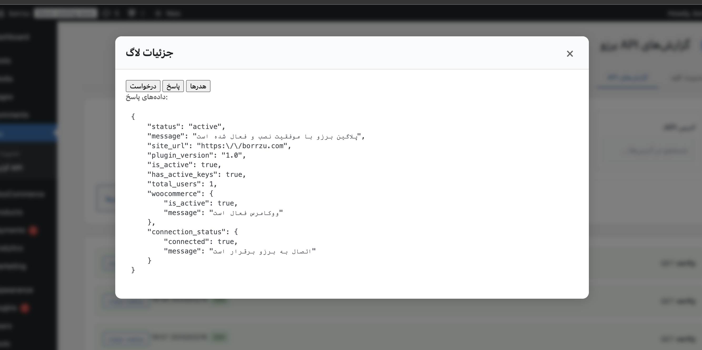

# Borrzu WordPress Plugin

A powerful WordPress plugin for managing API keys and monitoring API requests for Borrzu.com integration.

## 🚀 Features

- **Secure Key Management**: Generate and manage secret API keys for users
- **API Request Monitoring**: Track and monitor all API requests with detailed logs
- **Advanced Filtering**: Filter API logs by endpoint, status, and date range
- **User Verification**: Verify user accounts and purchases through secure API endpoints
- **WooCommerce Integration**: Seamlessly verify product purchases
- **Persian Language Support**: Full RTL support with Persian interface

## 📸 Screenshots

### API Logs Dashboard

*Monitor and filter API requests with detailed information*

### Key Management

*Securely manage API keys with regeneration capability*

### Detailed Request Logs

*View detailed request and response information in a clean modal interface*

## 🔧 Installation

1. Download the plugin zip file
2. Go to WordPress admin panel > Plugins > Add New
3. Click "Upload Plugin" and select the downloaded zip file
4. Click "Install Now" and then "Activate"

## ⚙️ Requirements

- WordPress 5.0 or higher
- PHP 7.4 or higher
- SSL Certificate (HTTPS) required
- WooCommerce (optional, for purchase verification)

## 🔒 Security Features

- Secure key generation using WordPress cryptographic functions
- Rate limiting for API key generation
- Nonce verification for all admin actions
- Data sanitization and validation
- SSL requirement enforcement

## 🛠️ API Endpoints

The plugin provides several REST API endpoints:
